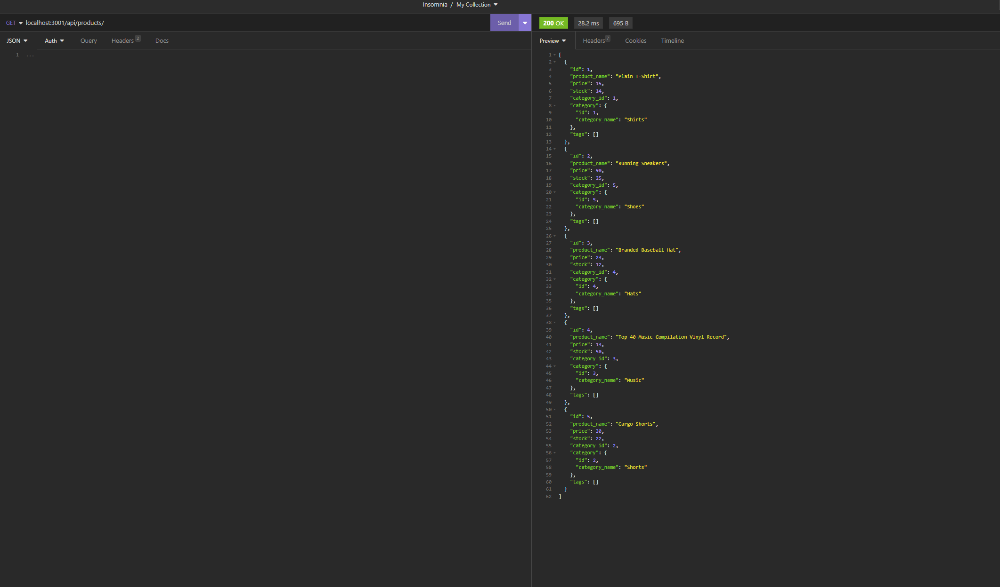

# CWRU Bootcamp Challenge 13 - Basic E-Commerce Backend

    
## Description
    
### The goal of this project was to create a basic E-Commerce Backend that allows for basic GET, POST, DEL, and PUT requests to interface with a connected Database, hosted via ExpressJS!
### Behind the scenes, this program heavily relies on MySQL again, but instead, is working synchronously with different software to better control and distribute data to an end user/program.

## Table of Contents

- [Installation](#installation)
- [Usage](#usage)
- [Video](#video)
- [Mockup](#mockup)
- [Contributing](#contributing)
- [License](#license)
- [Contact Me](#questions)

## Installation

1. Simply download the files, run 'npm install' to get the required packages! 
2. Then, run schema file "schema.sql" in the db folder with the 'source' command in MySQL! 
3. Afterwards, feel free to use the test seed provided by running 'npm run seed' 
4. Finally, include a .env file, you can use the example provided, just make sure you rename it after. Fill out your respective MySQL login information so the program can work correctly. 

## Usage

Once all of those steps have been taken, you should be good to start the server with 'npm start'!

## Video

### Here is a link to the video example showcasing the installation and usage of this project:

## Mockup

     
    An example display of a GET call of 'products' using Insomnia!

## Contributing

Feel free to fork this repo if you have anything you want to add, change, or remove in regards to this project. I love feedback!

## License

The license used in this project was the MIT license! Please reference the LICENSE file inside of the repository.

## Questions?

You can find me here on GitHub at https://www.github.com/Anthony-GG

Otherwise, feel free to reach me at anthony@vayneglory.com

---